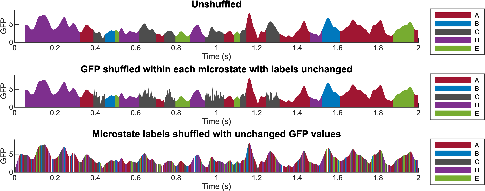

# Microstate spectral analysis

The Global Field Power (GFP) reflects the instantaneous strength of the EEG signal across the scalp and is obtained as the standard deviation of potentials across electrodes.This repository computes the spectral power of GFP associated with microstate sequences using Lomb–Scargle periodograms and uncovers its scale-free properties.

It includes three analysis conditions to examine how spectral properties depend on the temporal structure of the data:

- Unshuffled: Original GFP and microstate label sequences

- Label-shuffled: Microstate labels are shuffled while the GFP sequence remains unchanged

- GFP-shuffled: GFP values are shuffled within each microstate, while the label sequence remains unchanged

---

### Provided `.mat` file contains:

- GFP data: `Nepochs × Nsamples`  
- Corresponding microstate label sequences `Nepochs × Nsamples`  

---
### Input Parameters

The analysis requires the following:

- Number of microstates  
- Sampling frequency (Hz)  
- Maximum frequency for spectral analysis (Hz)

## Shuffling Conditions

## Contact
michael-christopher.foti.1@ens.etsmtl.ca
